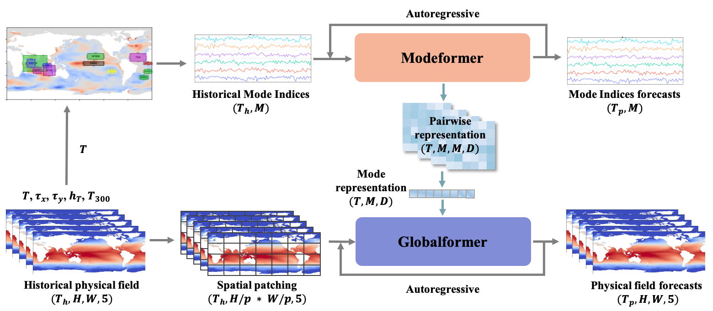

# UniCM

This repository provides the official implementation of **UniCM**, a unified deep model for global climate modes forecasting, as presented in the paper, "**Learning the coupled dynamics of global climate modes**". Contributors to this project are from the [Future Intelligence Lab](https://fi.ee.tsinghua.edu.cn) at [Tsinghua University](https://www.tsinghua.edu.cn/en/).



---

Global weather extremes, from monsoons to droughts, are shaped by a network of recurrent, coupled ocean-atmosphere patterns known as climate modes (e.g., El Niño-Southern Oscillation (ENSO), Indian Ocean Dipole (IOD)). Forecasting this interconnected global system—rather than treating modes in isolation—remains a fundamental challenge.

UniCM's key innovation is a **coupling-aware approach** that learns the dynamics of the entire coupled global system directly from data. It establishes a new state of the art, significantly outperforming previous models and extending the skillful forecast lead time for critical climate patterns.

## Key Features

*   **Unified Global Forecasting:** A single model that learns the coupled dynamics of global climate modes, capturing the non-linear interactions between patterns in the Pacific, Indian, and Atlantic oceans.
*   **Coupling-Aware Architecture:** Two spatio-temporal Transformers (Encoder-Decoder) designed to process multivariate climate data and model dependencies across different ocean basins.
*   **State-of-the-Art Performance:** Outperforms previous leading models in forecasting key climate modes, particularly for long lead times.

## Project Structure

```
.
├── src/                    # Source code directory
│   ├── app_train.py        # Main training script
│   ├── app_test.py         # Individual seed evaluation script
│   ├── app_ensemble.py     # Ensemble evaluation script
│   ├── models.py           # Core model definition (UniCM)
│   ├── Trainer.py          # Training and validation loop
│   ├── LoadData.py         # Data loading and preprocessing
│   ├── experiments/        # Directory for saved models and results
│   ├── script/             # Shell scripts for running experiments
│   │   ├── train.sh        # Script to run training
│   │   └── test.sh         # Script to run testing
│   └── ...
├── environment.yml         # Conda environment configuration
├── dataset/                # Dataset directory (expected)
└── README.md               # Project documentation
```

## Installation

### Environment Setup

This project uses **Conda** for environment management. You can create the environment directly from the provided `environment.yml` file.

1.  **Create the environment:**
    ```bash
    conda env create -f environment.yml
    ```

2.  **Activate the environment:**
    ```bash
    conda activate UniCM-env
    ```

The environment includes Python 3.11, PyTorch 2.0.1, and other necessary dependencies.

## Data Preparation

The data loaders in `src/LoadData.py` are configured to read preprocessed NetCDF (`.nc`) files.

You can specify the root directory for your datasets using the `--data_root` argument in the training/testing scripts (default is `../dataset`).

The directory structure under your `data_root` should be organized as follows:

```
data_root/
├── CMIP6/  # Training data (CMIP6 models)
├── ERA5/                # ERA5 reanalysis data
├── ORAS5/               # ORAS5 reanalysis data
├── SODA224/             # SODA reanalysis data
└── GODAS/           # GODAS reanalysis data
```

Ensure your dataset files are placed within these corresponding subdirectories. Valid dataset names (e.g., `CESM2-FV2*gr` for training) will be looked up within `CMIP6`.

## Usage

We provide shell scripts in `src/script/` to simplify training and testing.

### 1. Training

To train the model, use the `src/script/train.sh` script. This script runs `src/app_train.py` with the appropriate hyperparameters.

```bash
cd src
sh script/train.sh
```

**Inside `train.sh`:**
The script iterates through random seeds (1-20) to train multiple models, which is required for ensemble bagging.

```bash
for seed in $(seq 1 20)
do
    python app_train.py --batch_size 32 --cuda_id 0 \
        --climate_mode all --lambda3 1 --lambda2 0.01 --lambda1 1 \
        --lr 5e-4 --dropout 0.2 --mode training \
        --training_data CESM2-FV2*gr --patch_size '2-2' --exp_folder 'runs' \
        --result_filename 'train_result_all.txt' --epochs 2 --seed $seed
done
```

**Output:**
Results will be generated in `experiments/runs/SaveModel_Seed<SEED>/train_result_all.txt`.

**Key Parameters:**
*   `--mode training`: Sets the operation mode to training.
*   `--lambda1`, `--lambda2`, `--lambda3`: Loss coefficients for reconstruction, explicit mode prediction, and skill score constraint.
*   `--training_data`: The dataset identifier.
*   `--exp_folder`: Folder to save experiment results (defaults to `runs` or `experiments/train`).

### 2. Testing

To evaluate the trained model(s), use the `src/script/test.sh` script.

```bash
cd src
sh script/test.sh
```

**Inside `test.sh`:**
This script currently defaults to **Ensemble Testing**, but includes commented-out code for individual seed testing.

```bash
# Ensemble Testing
python app_ensemble.py --batch_size 32 --cuda_id 0 \
    --climate_mode all --lambda3 1 --lambda2 0.01 --lambda1 1 \
    --lr 5e-4 --dropout 0.2 --mode testing \
    --training_data CESM2-FV2*gr --patch_size '2-2' --exp_folder 'runs' \
    --num_ensemble 1 --result_filename 'test_result_ensemble.txt' \
    --pretrained_path 'runs/SaveModel'
```

**Ensemble Output:**
For ensemble testing, prediction results for physical fields and climate modes are saved in `experiments/<exp_folder>/Ensemble/`. The files include:

*   `physical_field_pred_<DATASET>.pkl`: Predicted physical fields.
*   `physical_field_target_<DATASET>.pkl`: Ground truth physical fields.
*   `pred_<DATASET>.pkl`: Predicted climate indices.
*   `target_<DATASET>.pkl`: Ground truth climate indices.
*   `test_result_ensemble.txt`: Summary of metrics.
*   `timestamps_all_<DATASET>.pkl`: Timestamps for the test data.

*(Where `<DATASET>` is ERA5, ORAS5, etc.)*

**Individual Testing:**
You can also run `app_test.py` for specific seeds to evaluate individual models. This script is currently commented out in `test.sh`.

```bash
for seed in $(seq 1 20)
do
    python app_test.py --batch_size 32 --cuda_id 0 \
        --climate_mode all --lambda3 1 --lambda2 0.01 --lambda1 1 \
        --lr 5e-4 --dropout 0.2 --mode testing \
        --training_data CESM2-FV2*gr --seed $seed --exp_folder 'runs' \
        --result_filename 'test_result_all.txt' --epochs 2
done
```

The results will be saved in `experiments/runs/SaveModel_Seed<SEED>/test_result_all.txt`.
